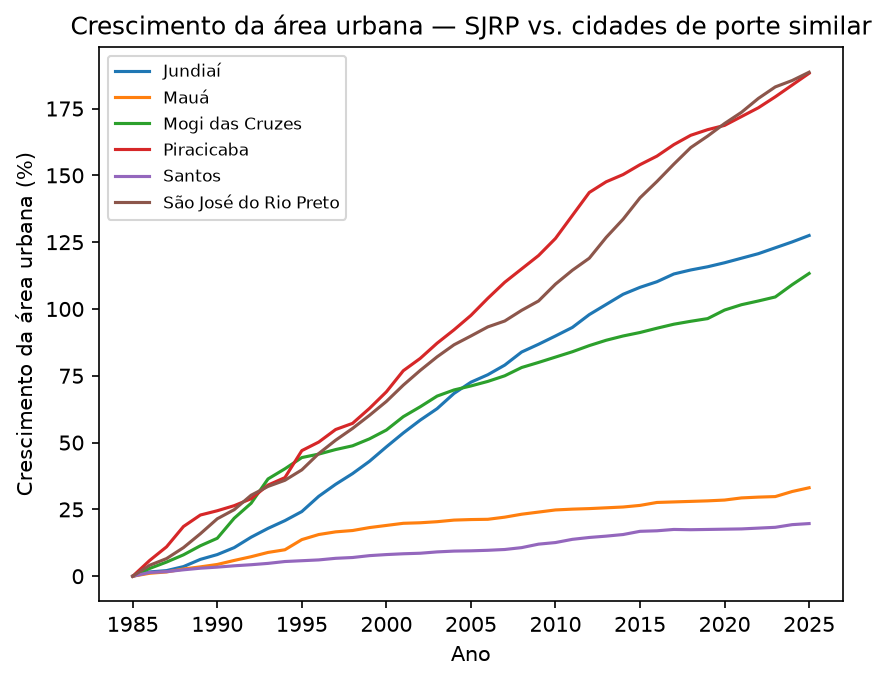
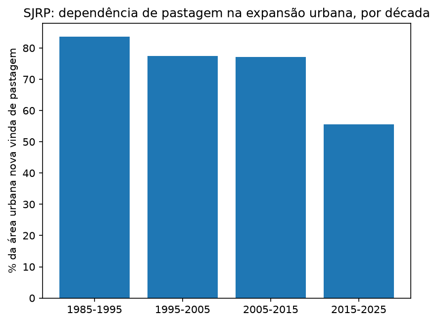

# Uso e Cobertura do Solo em São José do Rio Preto (1985–2025)

Este é um projeto de portfólio que fiz pra aprender banco de dados na prática, usando um
tema que eu tinha curiosidade de investigar: como a cidade de São José do Rio Preto (SP),
onde moro, cresceu fisicamente nos últimos 40 anos, e sobre o que ela cresceu. Também
comparo esse crescimento com o de 5 outras cidades paulistas de tamanho parecido (Mogi das
Cruzes, Jundiaí, Piracicaba, Santos e Mauá), pra ter um ponto de referência e não ficar só
olhando um número isolado.

Os dados vêm do [MapBiomas](https://brasil.mapbiomas.org/) (mapeamento de uso e cobertura
do solo por satélite, coleção 11) e do IBGE. O pipeline é Python pra ingestão, PostgreSQL
pra modelar e analisar, e Python de novo pra gerar os gráficos.

## O que eu encontrei

A área urbana de Rio Preto saiu de aproximadamente 4.100 hectares em 1985 pra cerca de
12.000 hectares em 2025 — quase triplicou. A parte mais interessante é o que essa área
substituiu: 82% de toda a expansão urbana desse período veio de cima de pastagem.

Mas esse número não é constante. Quebrando por década, a dependência de pastagem vem caindo:
84% entre 1985 e 1995, 78% entre 1995 e 2005, 77% entre 2005 e 2015, e só 56% entre 2015 e
2025. No lugar dela, "Mosaico de Usos" (áreas de uso agrícola misto) vem ganhando espaço
como origem da expansão nas últimas duas décadas.

Comparando com as outras cidades do grupo, Rio Preto foi quem mais converteu pastagem em
área urbana em números absolutos (5.818 ha). Do outro lado, Santos praticamente não fez
isso (1,5 ha) — mas faz sentido, é uma cidade litorânea que nunca teve muito pasto pra
começo de conversa. Em termos de ritmo de crescimento relativo, Piracicaba e Rio Preto
lideram o grupo (por volta de 190% desde 1985), enquanto Santos e Mauá cresceram bem menos
(entre 20% e 33%).

## Arquitetura

O pipeline é híbrido: Python lê os arquivos brutos e joga num banco PostgreSQL sem mexer
nos dados; dali pra frente é tudo SQL — modelagem em dimensões e fatos, e as perguntas da
análise viram views (usando JOIN, GROUP BY, window functions, RANK()). No final, Python lê
essas views e desenha os gráficos.

Documentei o processo de decisão e a implementação com mais detalhe aqui, caso alguém queira
entender o porquê de cada escolha:
- [Spec de design](docs/superpowers/specs/2026-08-15-uso-cobertura-solo-rio-preto-design.md)
- [Plano de implementação](docs/superpowers/plans/2026-08-15-uso-cobertura-solo-rio-preto-plan.md)

## Como rodar

1. Instale o PostgreSQL e crie um banco chamado `riopreto`
2. `pip install -r requirements.txt`
3. Baixe os dados brutos (fontes logo abaixo) e coloque na pasta `dados brutos/`
4. Crie um arquivo `src/db_config.py` com `PASSWORD = "sua_senha"` — esse arquivo fica de
   fora do Git de propósito, então cada pessoa usa a própria senha local
5. Rode, nessa ordem: `sql/01_schema.sql`, os três scripts de ingestão
   (`src/ingest_population.py`, `src/ingest_coverage.py`, `src/ingest_transition.py`),
   `sql/02_dimensions.sql`, `sql/03_facts.sql` e `sql/04_views_analise.sql`
6. `python src/charts.py`

Pra rodar os testes: `pytest tests/`

## De onde vêm os dados

Não subi os arquivos brutos pro repositório — o principal deles sozinho já passa de 75 MB,
e o GitHub não deixa.

- **MapBiomas, Coleção 11, Cobertura**: https://brasil.mapbiomas.org/downloads/estatisticas/
- **MapBiomas, Transições**: não tem planilha pronta pra baixar ainda nessa coleção, então
  usei a plataforma interativa (https://plataforma.brasil.mapbiomas.org) — módulo Cobertura
  → Transições, selecionando o território, o período e marcando todos os níveis de legenda
- **População dos municípios**: https://ftp.ibge.gov.br/Estimativas_de_Populacao/

## Stack

Python (pandas, psycopg2, matplotlib), PostgreSQL, pytest.
